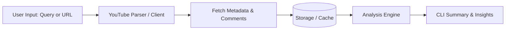

# Architecture & Design Decisions

This document outlines the architectural choices, trade-offs, and technical direction for **Audience Lens**.

---

### 1.1 Core Mission
**Audience Lens** helps content creators, researchers, and marketing teams discover what audiences really think. Instead of manually scrolling through hundreds or thousands of comments, Audience Lens automates:
1. Video discovery and comment ingestion.
2. Efficient local caching and storage of comments.
3. NLP & AI-driven sentiment analysis, theme extraction, and audience question detection.
4. Interactive reporting through dual interfaces (CLI and Web).

### 1.2 Multi-Interface & Product Deployment Strategy
To make the project accessible while responsibly managing API quotas and hosting costs:
- **Phase 1: Local Interactive CLI (Current)**
  - Full local tool for terminal power users, fast exploration, and headless workflows.
- **Phase 2: Local Web Server & GUI Dashboard**
  - Anyone cloning the repository can run the web server locally using their own YouTube API key, getting the full graphical dashboard experience.
- **Phase 3: Public Web Demo & Recruiter Evaluation Portal**
  - **Public Demo**: Showcase pre-computed analyses for benchmark videos so visitors can explore the UI and insights without making real-time API calls.
  - **Recruiter / Evaluator Access**: Token-authenticated portal for hiring managers and evaluators to run live queries on arbitrary videos using a controlled project API key without exposing quota to public abuse.

---

## 2. Technology Choices & Rationale

### 2.1 Python 3.10+
- **Why**: Python has the most mature ecosystem for data manipulation, NLP, LLM integrations, and scripting.
- Python 3.10+ provides modern typing features (`str | None`, pattern matching) and performance improvements.

### 2.2 `httpx` (Async) vs. `google-api-python-client`
- In early prototypes (`experiments/comment_experiment.py`), `google-api-python-client` was tested.
- **Decision**: Moving toward `httpx` for API requests.
  - **Benefits**:
    - Native `async/await` support with high throughput.
    - Lightweight footprint without the heavy dependency tree of Google's SDK.
    - Full control over request parameters, response payload filtering via Google's `fields` selector (drastically reducing network payload size and latency), and error handling.

### 2.3 CLI Experience: `questionary`
- Instead of requiring users to look up and copy-paste YouTube video IDs or construct complex terminal flags, Audience Lens provides an interactive prompt workflow.
- Users can search for a topic or video title, browse a formatted selection list with channel name and publish date, and select a video interactively with keyboard arrows.

### 2.4 Modular Source Architecture (`src/audience_lens/sources/`)
- Starting with `youtube/`, but structured as a provider-based architecture:
  ```text
  sources/
  ├── base.py          # Abstract interfaces for video & comment extractors
  ├── youtube/
  │   ├── client.py    # Async HTTP client and endpoints
  │   └── parser.py    # URL regex matching & data normalization
  └── (future) tiktok/ # Future expansion to other video platforms
  ```

---

## 3. Data Flow & Pipeline



1. **Input Ingestion**:
   - Accepts either a raw  video URL link (parsed via `parser.py`) or a free-text search query.
2. **Comment Ingestion(Upcoming)**:
   - Paginated retrieval of `commentThreads` and comment replies.
   - Field trimming (`fields` parameter) to extract only needed attributes (author, text, likes, timestamp, reply count).
3. **Local Storage / Caching (Upcoming)**:
   - Avoid burning API quota on re-runs for the same video.
   - Recommended structure: SQLite / DuckDB or JSONL snapshots.
4. **Analysis Pipeline (Upcoming)**:
   - Sentiment classification (positive, neutral, negative, constructive criticism).
   - Topic clustering / keyword extraction.
   - Question detection (identifying what viewers are asking for in future videos).

---

## 4. Current Challenges & Roadmap

### Fast Comment Ingestion & Quota Management
- YouTube API v3 enforces a daily quota budget (default 10,000 units/day).
- Search costs ~100 units; comment list costs ~1 unit per page.
- **Optimization Strategy**:
  - Prefer direct video URL/ID lookup when available (avoids 100 units search cost).
  - Use `fields` parameter to minimize bandwidth.
  - Implement concurrent fetching for reply threads where applicable.
  - Cache results locally to prevent duplicate requests.

### Storage Strategy
- As noted in `docs/useful_things.md`, storing high-volume comments efficiently is a priority:
  - Phase 1: Local structured JSON/JSONL export.
  - Phase 2: Lightweight embedded database (SQLite via `sqlite3` or DuckDB) for fast filtering, aggregation, and querying.
